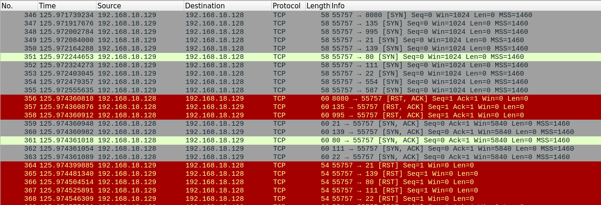
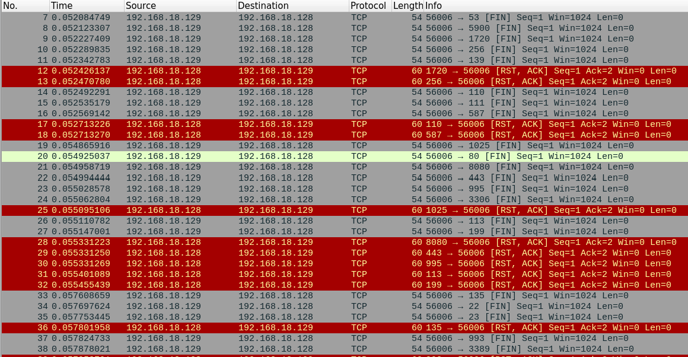
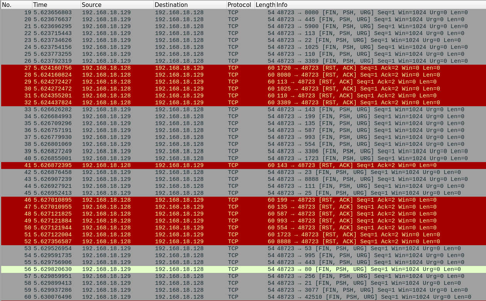

# Домашнее задание к занятию "Уязвимости и атаки на информационные системы`" - `Поздникин Е.Н.`


### Инструкция по выполнению домашнего задания

   1. Сделайте `fork` данного репозитория к себе в Github и переименуйте его по названию или номеру занятия, например, https://github.com/имя-вашего-репозитория/git-hw или  https://github.com/имя-вашего-репозитория/7-1-ansible-hw).
   2. Выполните клонирование данного репозитория к себе на ПК с помощью команды `git clone`.
   3. Выполните домашнее задание и заполните у себя локально этот файл README.md:
      - впишите вверху название занятия и вашу фамилию и имя
      - в каждом задании добавьте решение в требуемом виде (текст/код/скриншоты/ссылка)
      - для корректного добавления скриншотов воспользуйтесь [инструкцией "Как вставить скриншот в шаблон с решением](https://github.com/netology-code/sys-pattern-homework/blob/main/screen-instruction.md)
      - при оформлении используйте возможности языка разметки md (коротко об этом можно посмотреть в [инструкции  по MarkDown](https://github.com/netology-code/sys-pattern-homework/blob/main/md-instruction.md))
   4. После завершения работы над домашним заданием сделайте коммит (`git commit -m "comment"`) и отправьте его на Github (`git push origin`);
   5. В личном кабинете прикрепите и отправьте ссылку на решение в виде md-файла в вашем Github.
   6. Любые вопросы по выполнению заданий спрашивайте в разделе “Вопросы по заданию” в личном кабинете.
   
Желаем успехов в выполнении домашнего задания!
   
### Дополнительные материалы, которые могут быть полезны для выполнения задания

1. [Руководство по оформлению Markdown файлов](https://gist.github.com/Jekins/2bf2d0638163f1294637#Code)

---

### Задание 1
#### Какие сетевые службы в ней разрешены?
Запускаю Nmap где ключи:

-sV (service version detection) — определяет версии сервисов на открытых портах. Nmap смотрит на баннеры и ответы служб.
-O (OS detection) — пытается угадать операционную систему и её версию по сетевым откликам (TCP/IP‑стек, тайминги, особенности пакетов).
```
root@debian:/home/eugene# nmap -sV -O 192.168.18.128
```
Вижу 23 порта с их сервисами 
```
PORT     STATE SERVICE     VERSION
21/tcp   open  ftp         vsftpd 2.3.4
22/tcp   open  ssh         OpenSSH 4.7p1 Debian 8ubuntu1 (protocol 2.0)
23/tcp   open  telnet      Linux telnetd
25/tcp   open  smtp        Postfix smtpd
53/tcp   open  domain      ISC BIND 9.4.2
80/tcp   open  http        Apache httpd 2.2.8 ((Ubuntu) DAV/2)
111/tcp  open  rpcbind     2 (RPC #100000)
139/tcp  open  netbios-ssn Samba smbd 3.X - 4.X (workgroup: WORKGROUP)
445/tcp  open  netbios-ssn Samba smbd 3.X - 4.X (workgroup: WORKGROUP)
512/tcp  open  exec        netkit-rsh rexecd
513/tcp  open  login?
514/tcp  open  tcpwrapped
1099/tcp open  java-rmi    GNU Classpath grmiregistry
1524/tcp open  bindshell   Metasploitable root shell
2049/tcp open  nfs         2-4 (RPC #100003)
2121/tcp open  ftp         ProFTPD 1.3.1
3306/tcp open  mysql       MySQL 5.0.51a-3ubuntu5
5432/tcp open  postgresql  PostgreSQL DB 8.3.0 - 8.3.7
5900/tcp open  vnc         VNC (protocol 3.3)
6000/tcp open  X11         (access denied)
6667/tcp open  irc         UnrealIRCd
8009/tcp open  ajp13       Apache Jserv (Protocol v1.3)
8180/tcp open  http        Apache Tomcat/Coyote JSP engine 1.1
```
И информация о системе
```
MAC Address: 00:0C:29:96:61:4C (VMware)
Device type: general purpose
Running: Linux 2.6.X
OS CPE: cpe:/o:linux:linux_kernel:2.6
OS details: Linux 2.6.9 - 2.6.33
Network Distance: 1 hop
Service Info: Hosts:  metasploitable.localdomain, irc.Metasploitable.LAN; OSs: Unix, Linux; CPE: cpe:/o:linux:linux_kernel
```
#### Какие уязвимости были вами обнаружены? (список со ссылками: достаточно трёх уязвимостей)


https://www.exploit-db.com/exploits/49757
https://www.exploit-db.com/exploits/17491
https://www.exploit-db.com/exploits/6122
---

### Задание 2
1. SYN‑сканирование (полуоткрытое, «скрытое»)

```
sudo nmap -sS 192.168.18.128
```
-sS = TCP SYN scan.
Nmap отправляет SYN, не завершая TCP‑рукопожатие. Если приходит SYN‑ACK — порт открыт; RST — закрыт.


2. FIN‑сканирование
```
sudo nmap -sF 192.168.18.128
```
-sF = FIN scan. Отправляет пакет с флагом FIN.


3. Xmas‑сканирование
```
sudo nmap -sX 192.168.18.128
```
-sX = Xmas scan. В пакете установлены флаги FIN, PSH, URG.

4. UDP‑сканирование
```
sudo nmap -sU 192.168.18.128
```
-sU = UDP scan. Для UDP нет TCP‑флагов: ответ — ICMP Port Unreachable или данные от сервиса.
Важно: UDP‑сканы медленные: по умолчанию Nmap ждёт таймаут на каждый порт. Можно ускорить (но менее точно) через -T4 или указать конкретные порты.


#### Чем отличаются режимы сканирования с точки зрения сетевого трафика
| Режим | Флаги TCP | Что отправляет Nmap | Как это выглядит в Wireshark |
| --- | --- | --- | --- |
| **SYN (`-sS`)** | Только SYN | Один пакет SYN на порт. Нет ACK после SYN‑ACK. | В Wireshark: `TCP [SYN]` → `TCP [SYN, ACK]` (если открыт) или `TCP [RST, ACK]` (если закрыт). Нет полного 3‑way handshake. |
| **FIN (`-sF`)** | FIN | Пакет с флагом FIN (остальные флаги нулевые). | В Wireshark: `TCP [FIN]`. По стандарту RFC, закрытый порт должен ответить RST; открытый — игнорировать (не отвечать). |
| **Xmas (`-sX`)** | FIN+PSH+URG | Пакет с тремя флагами. | В Wireshark: `TCP [FIN, PSH, URG]`. Логика та же, что у FIN: закрытый порт — RST, открытый — молчание. |
| **UDP (`-sU`)** | Нет флагов TCP | UDP‑датаграмма на порт. | В Wireshark: UDP‑пакет. Если порт закрыт — ICMP Port Unreachable. Если открыт — ответ от сервиса или тишина (таймаут). |

#### Как отвечает сервер  на разные типы сканирования
- SYN‑scan
  - Открытый порт: Metasploitable (Linux) отвечает SYN‑ACK. Nmap сразу шлёт RST, чтобы не оставлять полуоткрытые соединения. В Wireshark ты увидишь именно эту пару: SYN → SYN‑ACK → RST.
  - Закрытый порт: Сервер сразу отвечает RST на SYN.
  - Отфильтрованный порт: Нет ответа (или ICMP Destination Unreachable) — значит, фаервол блокирует.
- FIN‑scan и Xmas‑scan
Эти методы полагаются на нестандартное поведение стека TCP.

  - Закрытый порт: Linux (Metasploitable) следует RFC и отвечает RST.
  - Открытый порт: По спецификации, стек должен игнорировать «некорректные» пакеты (FIN/Xmas) и не отвечать. Поэтому в Wireshark на открытых портах ты не увидишь ответа — только исходящий скан‑пакет. Отсутствие ответа Nmap трактует как «open|filtered».
  - Нюанс: Не все ОС ведут себя строго по RFC. Windows, например, может отвечать RST и на открытые порты, из‑за чего FIN/Xmas дают много ложноположительных «закрытых».
- UDP‑scan
UDP принципиально другой: нет состояния соединения.

  - Открытый UDP‑порт: Сервис может ответить данными (например, BIND на 53 вернёт DNS‑ответ, nfsd на 2049 — RPC‑ответ). В Wireshark увидишь UDP‑ответ.
  - Закрытый UDP‑порт: Ядро Linux отправляет ICMP Port Unreachable. В Wireshark — ICMP Type 3 Code 3.
  - Фильтруемый UDP‑порт: Нет ответа вообще. Nmap по таймауту считает порт «open|filtered». Это самая частая неопределённость в UDP‑сканировании.
---
