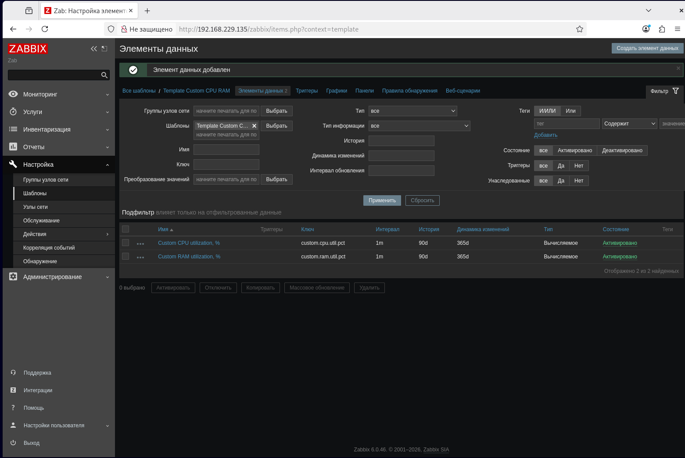
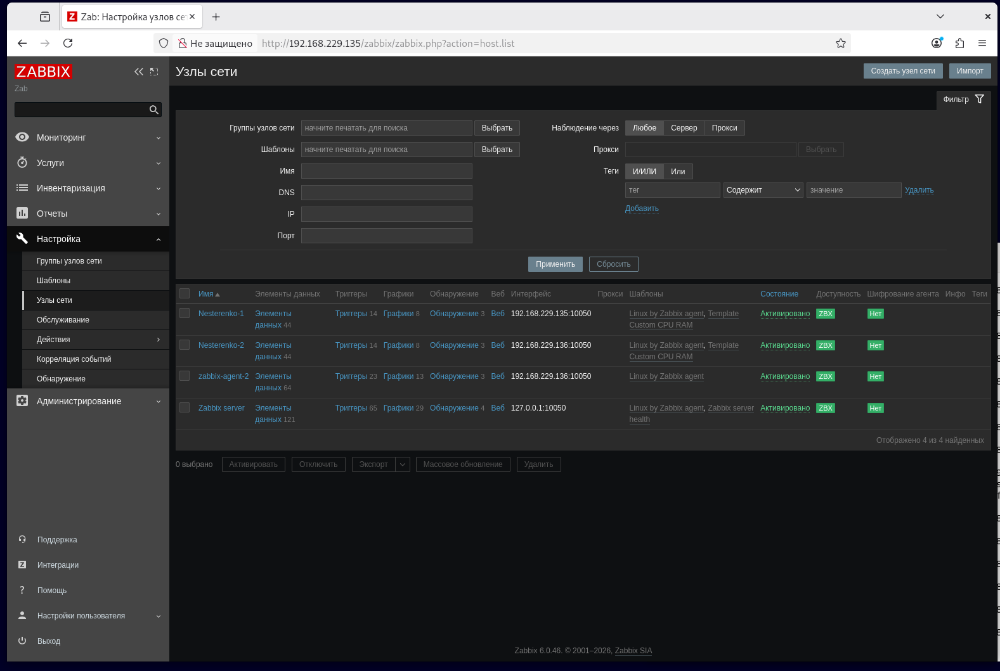
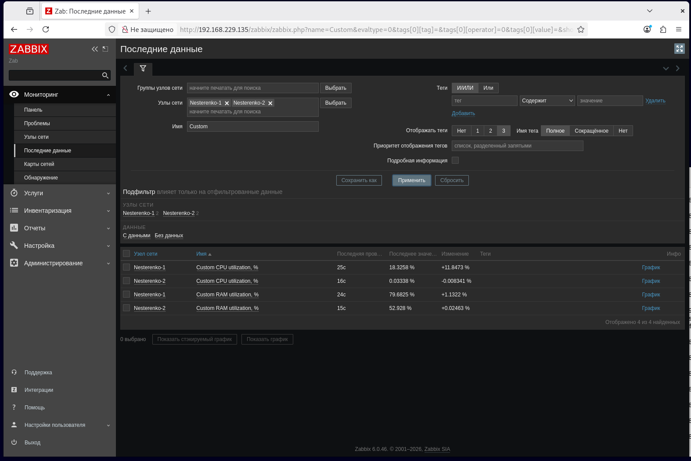
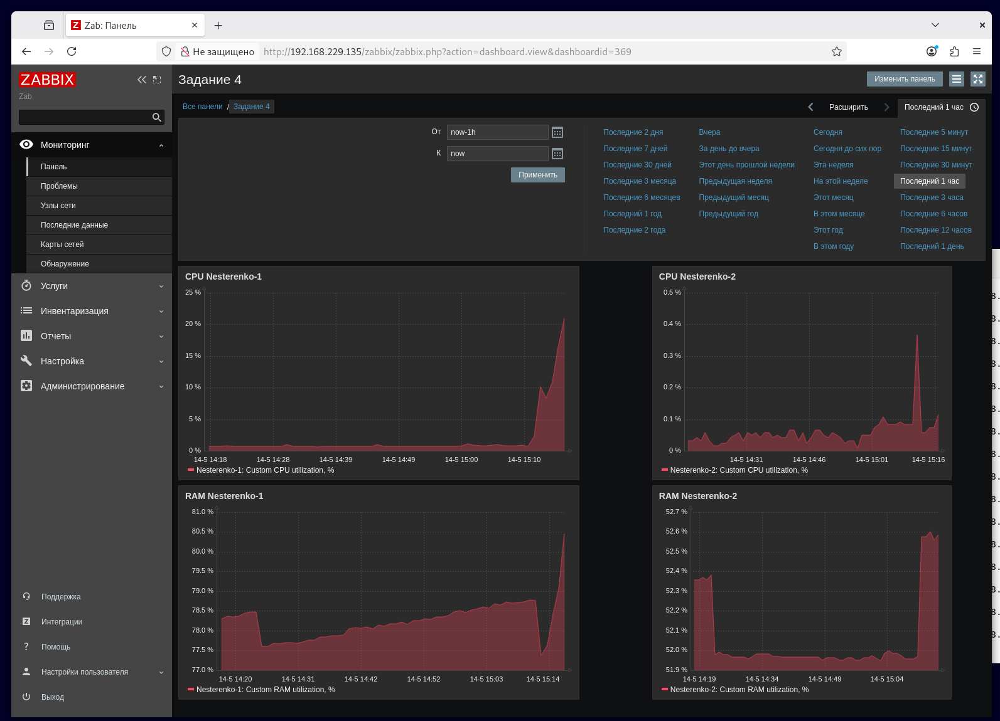
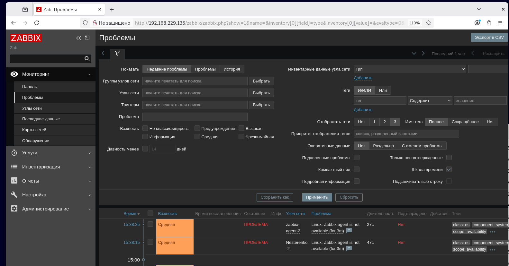
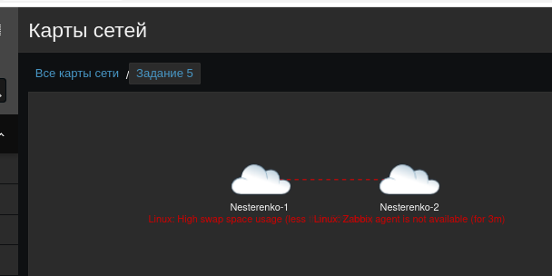
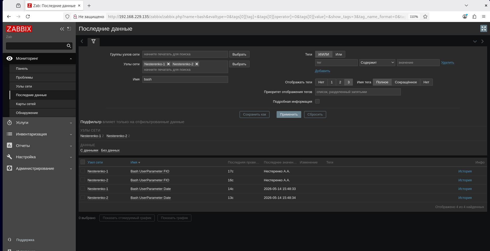
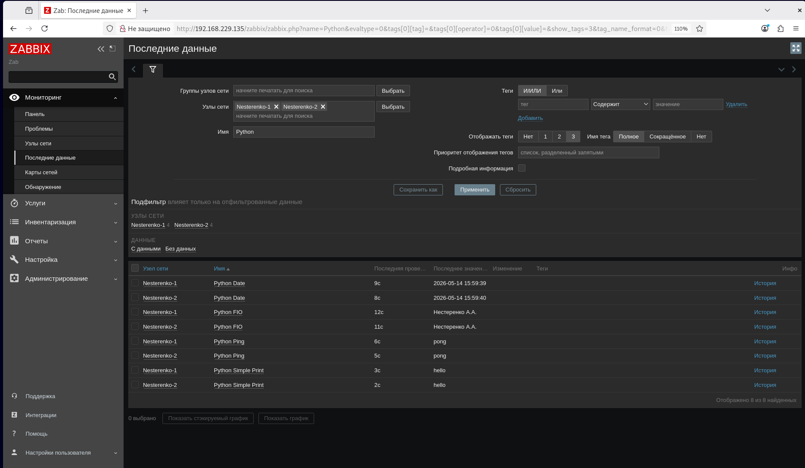
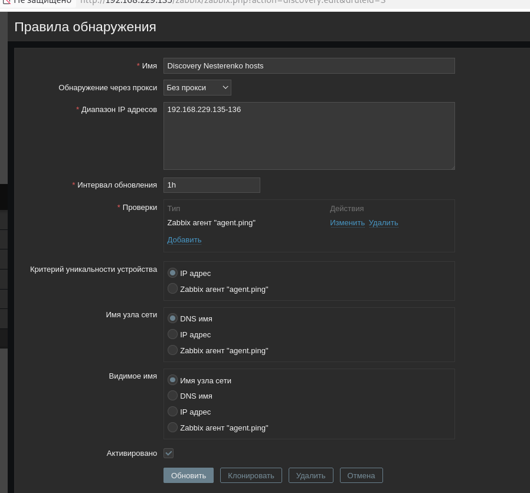
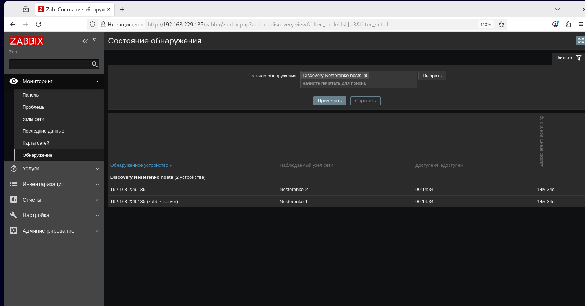

# Практическая работа по Zabbix

## Цель работы

В ходе практической работы были выполнены следующие задачи:

- создан пользовательский шаблон в Zabbix;
- добавлены два хоста с Zabbix Agent;
- к хостам привязаны стандартный и пользовательский шаблоны;
- создан кастомный дашборд;
- создана карта сети с двумя хостами;
- создан UserParameter на Bash;
- создан UserParameter на Python;
- настроено автообнаружение хостов и автоматическое присоединение шаблонов.

---

## Задание 1

Создан пользовательский шаблон `Template Custom CPU RAM`, предназначенный для мониторинга загрузки CPU и RAM хоста.

В шаблоне были созданы следующие элементы данных:

| Название элемента | Ключ | Описание |
|---|---|---|
| `Custom CPU utilization, %` | `custom.cpu.util.pct` | Отображает загрузку CPU в процентах |
| `Custom RAM utilization, %` | `custom.ram.util.pct` | Отображает загрузку RAM в процентах |

Скриншот страницы шаблона:



---

## Задание 2-3

В Zabbix были добавлены два хоста:

| Имя хоста | IP-адрес | Интерфейс |
|---|---|---|
| `Nesterenko-1` | `192.168.229.135` | `10050` |
| `Nesterenko-2` | `192.168.229.136` | `10050` |

К обоим хостам были привязаны шаблоны:

- `Linux by Zabbix agent`
- `Template Custom CPU RAM`

После настройки оба хоста получили зелёный статус доступности `ZBX`.

Скриншот страницы хостов:



Также была выполнена проверка поступления данных из пользовательского шаблона в разделе `Latest data`.

Скриншот Latest data:



---

## Задание 4

Создан кастомный дашборд `Задание 4`.

На дашборд были добавлены графики для отображения загрузки CPU и RAM для двух хостов:

- `CPU Nesterenko-1`
- `RAM Nesterenko-1`
- `CPU Nesterenko-2`
- `RAM Nesterenko-2`

Скриншот дашборда:


---

## Задание 5

Была создана карта сети `Задание 5`, на которой размещены два хоста:

- `Nesterenko-1`
- `Nesterenko-2`

Между хостами была настроена связь.  
К связи был привязан триггер, связанный с недоступностью Zabbix Agent на одном из хостов.

При срабатывании триггера линия связи меняет состояние на красную пунктирную линию.

Скриншот карты сети со сработавшим триггером:



---

## Задание 6

Был создан пользовательский параметр `UserParameter` на Bash.

Скрипт принимает аргумент:

- при получении `1` возвращает ФИО;
- при получении `2` возвращает текущую дату.

### Bash-скрипт

Файл:
```
#!/bin/bash

case "$1" in
  1)
    echo "Нестеренко А.А."
    ;;
  2)
    date "+%Y-%m-%d %H:%M:%S"
    ;;
  *)
    echo "Unknown parameter"
    ;;
esac
```
Скриншот результата работы Bash UserParameter в Latest data:



## Задание 7

Был создан пользовательский параметр `UserParameter` на Python.

Python-скрипт выполняет следующие действия:

- при получении параметра `1` возвращает ФИО;
- при получении параметра `2` возвращает текущую дату;
- при получении параметра `-ping` возвращает `pong`;
- при получении параметра `-simple_print.*` возвращает значение после `-simple_print.`.

### Python-скрипт
Код скрипта:

```python
#!/usr/bin/env python3

import sys
from datetime import datetime


def main():
    if len(sys.argv) < 2:
        print("No parameter")
        return

    arg = sys.argv[1]

    if arg == "1":
        print("Нестеренко А.А.")

    elif arg == "2":
        print(datetime.now().strftime("%Y-%m-%d %H:%M:%S"))

    elif arg == "-ping":
        print("pong")

    elif arg.startswith("-simple_print."):
        text = arg.replace("-simple_print.", "", 1)
        print(text)

    else:
        print("Unknown parameter")


if __name__ == "__main__":
    main()
```

### UserParameter

Содержимое файла:

```ini
UserParameter=custom.py[*],/usr/bin/python3 /etc/zabbix/scripts/myinfo.py "$1"
```

В созданный ранее шаблон `Template Custom CPU RAM` были добавлены элементы данных для Python-скрипта:

| Название элемента | Ключ | Тип информации |
|---|---|---|
| `Python FIO` | `custom.py[1]` | Текст |
| `Python Date` | `custom.py[2]` | Текст |
| `Python Ping` | `custom.py[-ping]` | Текст |
| `Python Simple Print` | `custom.py[-simple_print.hello]` | Текст |

После настройки в разделе `Latest data` появились результаты работы Python-скрипта для параметров `1`, `2`, `-ping` и `-simple_print.*`.

Скриншот результата работы Python UserParameter в Latest data:


## Задание 8

Было настроено автообнаружение хостов Zabbix Agent и автоматическое прикрепление к ним созданного ранее шаблона.

Создано правило обнаружения `Discovery Nesterenko hosts`.

Параметры правила обнаружения:

| Параметр | Значение |
|---|---|
| Диапазон IP-адресов | `192.168.229.135-136` |
| Проверка | `Zabbix agent` |
| Ключ проверки | `agent.ping` |
| Критерий уникальности устройства | `IP адрес` |
| Состояние правила | `Активировано` |

Скриншот правила обнаружения:



Также было создано действие обнаружения `Auto add Nesterenko hosts`.

Условия действия:

- правило обнаружения равно `Discovery Nesterenko hosts`;
- состояние обнаружения равно `Доступен`;
- тип сервиса равен `Zabbix agent`.

Операции действия:

- добавить узел сети;
- добавить узел сети в группу `Linux servers`;
- присоединить шаблоны `Linux by Zabbix agent` и `Template Custom CPU RAM`;
- активировать узел сети.

В результате автообнаружения были найдены оба хоста:

| IP-адрес | Наблюдаемый узел сети |
|---|---|
| `192.168.229.135` | `Nesterenko-1` |
| `192.168.229.136` | `Nesterenko-2` |

Скриншот страницы обнаружения, где видны оба хоста:


